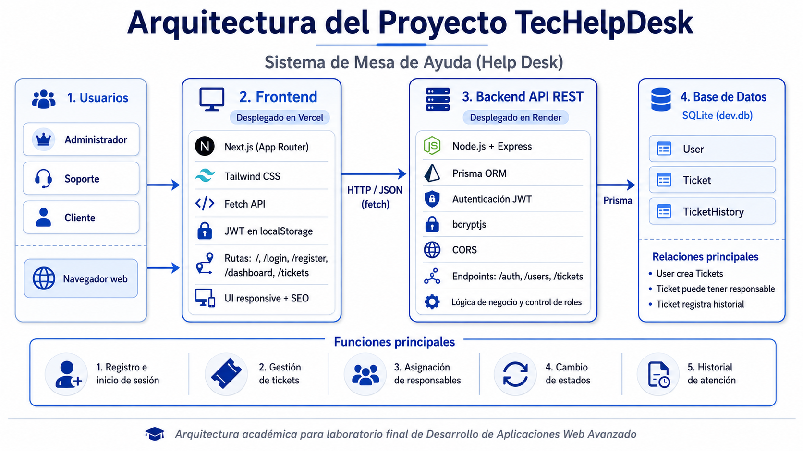

# TecHelpDesk

TecHelpDesk es una aplicación web full-stack de Mesa de Ayuda / Help Desk para registrar, gestionar, asignar y dar seguimiento a tickets de soporte.

Incluye autenticación, permisos por rol, gestión del ciclo de vida de tickets, asignación de responsables, actualización de estados e historial de atención.



## Características

- Registro e inicio de sesión de usuarios.
- Autenticación con JWT.
- Contraseñas encriptadas con bcrypt.
- Control de acceso basado en roles.
- Creación, listado, detalle y edición de tickets.
- Asignación de responsables de soporte.
- Actualización de estados de tickets.
- Historial automático y manual de atención.
- Interfaz responsive y moderna.
- SEO básico con metadata, sitemap, robots y manifest.

## Roles

- `ADMIN`: administra usuarios y tickets, asigna responsables, cambia estados y elimina tickets.
- `SOPORTE`: atiende tickets, puede autoasignarse tickets sin responsable, cambiar estados y agregar comentarios al historial.
- `CLIENTE`: crea tickets, visualiza sus propios tickets, actualiza tickets abiertos y agrega comentarios.

## Tecnologías

Backend:

- Node.js
- Express
- Prisma ORM 6
- SQLite
- JWT
- bcryptjs
- dotenv
- cors

Frontend:

- Next.js App Router
- React
- JavaScript
- Tailwind CSS
- Fetch API nativo
- localStorage para sesión JWT

## Estructura del proyecto

```text
TecHelpDesk/
  backend/
    prisma/
    src/
    package.json
    .env.example
  frontend/
    src/
    public/
    package.json
    .env.example
  docs/
  README.md
```

## Requisitos

- Node.js 20 o superior.
- npm.

## Variables de entorno

Crear `backend/.env`:

```env
DATABASE_URL="file:./dev.db"
JWT_SECRET="reemplazar_por_un_secreto_seguro"
PORT=4000
NODE_ENV=development
CORS_ORIGIN="http://localhost:3000"
```

Crear `frontend/.env.local`:

```env
NEXT_PUBLIC_API_URL=http://localhost:4000/api
NEXT_PUBLIC_SITE_URL=http://localhost:3000
```

Archivos de ejemplo incluidos:

- `backend/.env.example`
- `frontend/.env.example`

## Instalación

Clonar el repositorio:

```bash
git clone URL_DEL_REPOSITORIO
cd TecHelpDesk
```

Instalar y preparar el backend:

```bash
cd backend
npm install
npx prisma generate
npx prisma migrate deploy
node prisma/seed.js
```

Instalar el frontend:

```bash
cd ../frontend
npm install
```

## Ejecución local

Iniciar backend:

```bash
cd backend
npm run dev
```

URL del backend:

```text
http://localhost:4000/api
```

Iniciar frontend:

```bash
cd frontend
npm run dev
```

URL del frontend:

```text
http://localhost:3000
```

## Credenciales de prueba

- Administrador: `admin@techelpdesk.com` / `Admin123456`
- Soporte: `soporte@techelpdesk.com` / `Soporte123456`
- Cliente: `cliente@techelpdesk.com` / `Cliente123456`

## Scripts del backend

```bash
npm run dev
npm run start
npm run prisma:migrate
npm run prisma:deploy
npm run prisma:generate
npm run prisma:studio
npm run seed
```

## Scripts del frontend

```bash
npm run dev
npm run build
npm run start
npm run lint
```

## Endpoints principales

URL base:

```text
http://localhost:4000/api
```

Sistema:

- `GET /health`
- `GET /db-check`

Autenticación:

- `POST /auth/register`
- `POST /auth/login`
- `GET /auth/me`

Usuarios:

- `GET /users`
- `GET /users/support`

Tickets:

- `GET /tickets`
- `POST /tickets`
- `GET /tickets/:id`
- `PUT /tickets/:id`
- `PATCH /tickets/:id/assign`
- `PATCH /tickets/:id/status`
- `POST /tickets/:id/histories`
- `GET /tickets/:id/histories`
- `DELETE /tickets/:id`

## Rutas del frontend

- `/`
- `/login`
- `/register`
- `/dashboard`
- `/tickets`
- `/tickets/new`
- `/tickets/[id]`
- `/tickets/[id]/edit`
- `/sitemap.xml`
- `/robots.txt`

## Build de producción

Backend:

```bash
cd backend
npm run start
```

Frontend:

```bash
cd frontend
npm run build
npm run start
```

## Despliegue

El backend puede desplegarse como servicio Node.js.

Comando recomendado de build para backend:

```bash
npm install && npx prisma generate && npx prisma migrate deploy && node prisma/seed.js
```

Comando recomendado de inicio para backend:

```bash
npm start
```

El frontend puede desplegarse como aplicación Next.js.

Comando recomendado de build para frontend:

```bash
npm run build
```

Variables de entorno para frontend en producción:

```env
NEXT_PUBLIC_API_URL=https://URL_DEL_BACKEND/api
NEXT_PUBLIC_SITE_URL=https://URL_DEL_FRONTEND
```

Variables de entorno para backend en producción:

```env
DATABASE_URL=file:./dev.db
JWT_SECRET=reemplazar_por_un_secreto_seguro
NODE_ENV=production
CORS_ORIGIN=https://URL_DEL_FRONTEND
```

## Nota sobre la base de datos

Este proyecto utiliza SQLite por simplicidad. Para un entorno de producción real se recomienda usar PostgreSQL u otra base de datos administrada.
